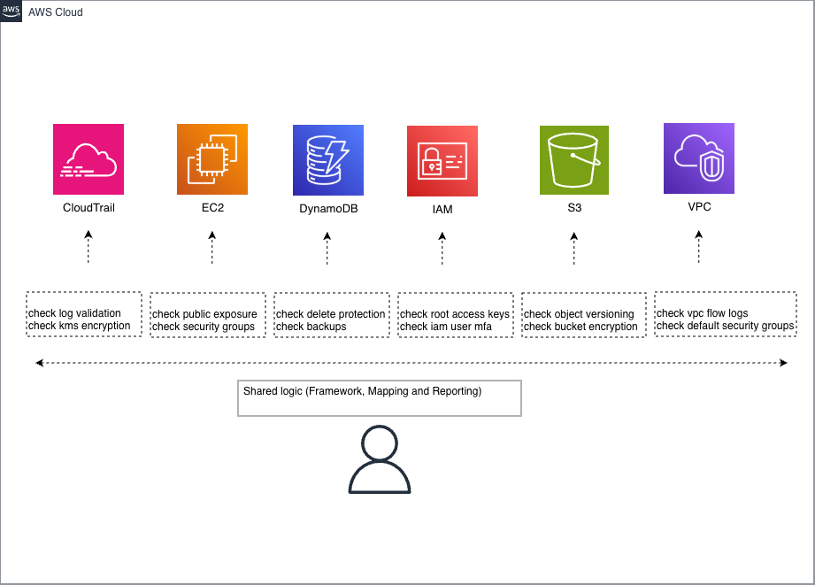

# AWS Security Benchmark Audit Toolkit (Lite CSPM)

A semi-automated, lightweight **Cloud Security Posture Management (CSPM)** tool designed to audit core AWS services (IAM, S3, VPC, DynamoDB, and CloudTrail) against industry-standard benchmarks. 

This project demonstrates practical cloud security engineering by auditing AWS resources against industry best practices and security frameworks such as **CIS AWS Foundations** and **NIST 800-53**. It is built using **Python 3.14** and **Boto3**.

---

## 🎯 Objectives

- **Identify Misconfigurations:** Detect common AWS security gaps automatically.
- **Framework Mapping:** Align technical findings to security frameworks (CIS, NIST).
- **Structured Reporting:** Produce consistent, actionable audit reports in JSON and CSV.
- **Scalable Design:** Demonstrate a modular architecture capable of auditing complex environments.

---

## 🧱 Architecture

Each AWS service is handled by a dedicated audit module, ensuring isolation and ease of maintenance. Global logic (Boto3 clients, logging, and compliance mapping) is centralised in the `shared` package to maintain a "DRY" (Don't Repeat Yourself) codebase.

- **Service Isolation:** Modules are decoupled; adding a new service audit (e.g., RDS) requires zero changes to existing modules.
- **Compliance-as-Code:** Centralised mapping logic links Boto3 responses directly to **CIS AWS Foundations** and **NIST 800-53** controls.
- **Parallel Execution:** Utilises Python's threading capabilities to audit large environments across multiple services simultaneously. 
- **Uniform Schema:** Regardless of the service, all findings are returned in a consistent, report-ready structure.



---

## 📂 Project Structure

```text
network_and_cloud_automation/
├── cloud_security_automation/   # Main Package
│   ├── aws_cloudtrail_audit/    # Individual Audit Modules
│   ├── aws_dynamodb_audit/
│   ├── aws_ec2_audit/
│   ├── aws_iam_audit/
│   ├── aws_vpc_audit/
│   ├── shared/                  # Core Utilities
│   │   ├── Results/             # Default output directory
│   │   ├── audit_cli.py         # Entry point (CLI Logic)
│   │   ├── aws_clients.py       # Thread-safe Boto3 wrappers
│   │   ├── frameworks.py        # CIS/NIST mapping logic
│   │   ├── logger.py            # Structured logging
│   │   └── report.py            # JSON/CSV generator
│   └── tests/                   # Pytest suite
├── terraform/                   # IaC for Audit Verification
│   ├── dynamodb/
│   ├── ec2/
│   ├── s3/
│   ├── vpc/
│   └── provider.tf              # Global provider config
├── pyproject.toml               # Project metadata & builds
└── requirements.txt             # Dependency list

```

---

🚀 Getting Started

📦 Requirements

-   Python 3.13+: Utilises modern type hinting and performance improvements.

-   Terraform 1.5+: Required for provisioning test environments.

-   AWS CLI: Configured with valid credentials and a default region.

-       Note: For security, it is highly recommended to use an IAM user or role with the managed ReadOnlyAccess policy.

🛠️ Installation

1.    Clone the Repository:

```bash

git clone https://github.com/amaruxia42/cloud_and_network_automation.git

cd cloud_and_network_automation

```

---

2. Environment Setup: Create and activate a virtual environment to manage dependencies locally:

```bash

python3 -m venv .venv
source .venv/bin/activate

```

3. Install Dependencies: Install the toolkit in editable mode. This ensures that the shared and audit modules are correctly registered within your Python path:

```bash

pip install -e .

```

---


💻 Usage

The toolkit is executed as a module from the root directory. This ensures all internal paths and imports resolve correctly.

Full Audit (All Services):

```bash

python3 -m cloud_security_automation.shared.audit_cli

```

Targeted Audit (Specific Services):

```bash

python3 -m cloud_security_automation.shared.audit_cli --services S3 IAM --format json

```

---

🏗️ Infrastructure Testing

To ensure the accuracy of the CSPM audit logic, this project utilises a dual-testing strategy: Terraform for resource provisioning and Pytest for functional validation.

🛠️ Provisioning Test Resources (Terraform)

For services requiring physical resources to validate misconfigurations (e.g., public S3 buckets), Terraform modules are provided in the terraform/ directory.

Supported Services: S3, DynamoDB, EC2, and VPC.

1. Navigate to one of the services directories and initialise terraform:

```bash

cd terraform/s3
terraform init  

```

2. Auto apply

```bash

terraform apply -auto-approve

```

3. Verify Audit:

    Execute the toolkit against the "vulnerable" infrastructure to confirm detection accuracy.

```bash

python3 -m cloud_security_automation.shared.audit_cli --services S3 IAM --format json

```

4. Audit results are saved into the Results folder from where the script was executed.

```bash

cloud_and_network_automation % python3 -m cloud_security_automation.shared.audit_cli --services S3 IAM --format json

Results/aws_services_audit_results_30-01-2026-10:14:08.json

```

5. Clean up 

```bash

terraform destroy

```

---

🧪 Functional Testing (Pytest)

Used primarily for IAM and CloudTrail logic where API mocking is more efficient than resource provisioning.

```bash

pytest

```

---

🛡️ Compliance Mapping & Frameworks
Supported Frameworks

-   CIS AWS Foundations Benchmark (v3.0.0): Focuses on identity management, logging, and networking best practices.

-    NIST Special Publication 800-53: Maps technical configurations to federal security controls (e.g., AC-2 for Account Management).

Severity Categorisation

Findings are prioritised based on environmental impact:

-    Critical: Immediate risk (e.g., Root account MFA disabled).

-    High: Significant exposure (e.g., S3 buckets with public read/write access).

-    Medium: Configuration drift (e.g., Security Groups with overly broad rules).

-    Low: Best practice optimisations.

---

⚠️ Disclaimer

This tool is for auditing and educational purposes only. Always validate findings before applying changes in a production environment.
Author

Robert Wright Cloud/Network Security Enthusiast

GitHub: @amaruxia42
License

Distributed under the Unlicense. See LICENSE.txt for more information.
